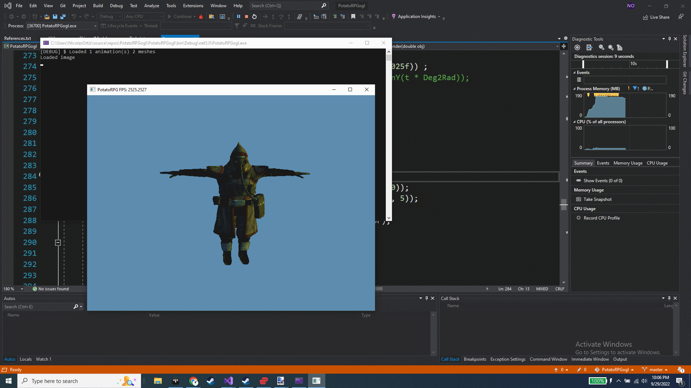

# CSharpOpenGL3DSkinnedMesh
Tried to implement skeletal animations with C# OpenGL.

Animations don't work yet but at least we can render a 3D character model with textures and some basic lighting.

Also, uses Quaternions for orienting the camera and some other stuff.

Copyright 2022 Nicolas Ortiz S.

